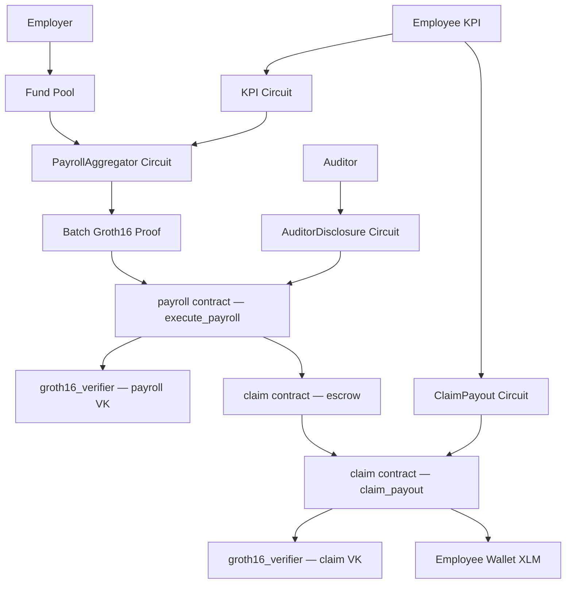

# MeritPay

**Privacy-preserving, merit-based payroll with private KPI proofs and selective auditor disclosure on Stellar.**

[](https://developers.stellar.org/)
[](https://docs.circom.io/)
[](LICENSE)

---

## Problem

Performance-based pay is the norm across most industries, but implementing it on shared infrastructure exposes deeply sensitive data. When payroll is processed on-chain or through collaborative tools, employers inadvertently reveal individual salaries, raw KPI scores, hours worked, and sales figures to colleagues, competitors, or the public.

The result: companies avoid on-chain payroll entirely, leaving the efficiency and transparency benefits of blockchain — immutable audit trails, automated execution, elimination of payroll intermediaries — completely unrealised.

The core tension: **you need to prove a computation is correct without revealing the inputs that drove it.**

---

## Solution

MeritPay uses zero-knowledge proofs to execute privacy-preserving, merit-based payroll on Stellar.

Employees prove their KPI metrics (hours worked, sales targets hit) in zero-knowledge — the employer learns only that the employee *qualifies* for a bonus, not what their actual numbers were. The payroll aggregator circuit computes the correct bonus-adjusted payout for all five employees and produces a single on-chain proof that the total is correctly derived. An auditor can receive a selective disclosure proof showing the total payroll is within budget, without seeing any individual's salary or bonus.

The on-chain Groth16 verifier (deployed as a Soroban contract, using Stellar's BN254 host functions) checks the proof and — if valid — authorises the payroll pool to release XLM to each employee. No trusted third party, no exposed salary data, no off-chain oracle required.

---

## ZK Value — The Differentiator

- **Provably correct bonus calculation**: The `PayrollAggregator` circuit constrains that each payout equals `baseSalary * (1 + bonusRate/100)` where `bonusRate` is derived from private KPI inputs. An employer cannot inflate or deflate a bonus without invalidating the proof. Division is handled without floats using a multiplication constraint (`bonus * 100 === baseSalary * bonusRate`), keeping the circuit R1CS-clean.

- **Nullifier-backed anti-replay**: Each payroll proof includes per-employee Poseidon nullifiers (`Poseidon(employeeId, payrollEpoch, salt)`) committed to in the circuit and checked on-chain. The Soroban payroll contract maintains a nullifier set — the same proof cannot trigger a double-payment even if replayed.

- **Private individual claims**: After batch verification, employees claim individually using a separate `ClaimPayout` circuit. Only a nullifier hash, epoch, and payout amount appear on-chain — no salary table, no bonus breakdown, no KPI data.

- **Selective auditor disclosure with budget gating**: The `AuditorDisclosure` circuit lets a designated auditor verify that `totalPayroll <= budget` and that the total is consistent with the individual payouts — all without learning any single employee's salary.

---

## Architecture



**Two-step flow:**

| Step | Who | Contract | What happens |
|------|-----|----------|--------------|
| **Execute** | Admin | `payroll` | Verifies PayrollAggregator proof; marks batch nullifiers spent; moves total XLM → claim escrow |
| **Claim** | Employee | `claim` | Verifies ClaimPayout proof; checks nullifier was in executed batch; transfers XLM to employee wallet |

---

## Tech Stack

| Component | Technology |
|---|---|
| ZK DSL | Circom 2.0 + circomlib |
| Proof System | Groth16 / snarkjs |
| Curve | BN254 (native Stellar host functions) |
| Hash Function | Poseidon (ZK-friendly, for nullifiers and KPI commitments) |
| Smart Contracts | Soroban (Rust), compiled to `wasm32v1-none` |
| Blockchain | Stellar Testnet |
| Wallet | Freighter (`@stellar/freighter-api` v4) |
| Frontend | Next.js 16 + React 19 + Tailwind CSS 4 |
| Stellar SDK | `@stellar/stellar-sdk` v14 |

---

## Prerequisites

**Node.js 18+**, **Rust stable**, **Circom 2.0**, **Stellar CLI**:

```bash
# Rust (if not installed)
curl --proto '=https' --tlsv1.2 -sSf https://sh.rustup.rs | sh
rustup target add wasm32v1-none

# Circom (requires Rust)
cargo install circom

# Stellar CLI
cargo install --locked stellar-cli --features opt

# wasm-opt (optional — smaller contract WASM)
sudo apt-get install binaryen   # or: brew install binaryen
```

---

## Setup

### 1. Clone and install

```bash
git clone https://github.com/your-org/meritpay
cd meritpay
cd circuits && npm install && cd ..   # installs snarkjs + circomlib
```

### 2. Compile circuits and run trusted setup

```bash
chmod +x scripts/setup.sh
./scripts/setup.sh
```

This compiles all four Circom circuits, downloads Powers of Tau files (pot12 ~54 MB, pot14 ~220 MB), runs Groth16 Phase 2 per circuit, exports verification keys, and syncs WASM + zkey files to `web/public/circuits/`.

Set `SKIP_PTAU=1` to skip re-downloading if ptau files are already present.

### 3. Deploy to Stellar Testnet

```bash
# Create a local Stellar identity (first-time only)
stellar keys generate deployer --network testnet

chmod +x scripts/deploy.sh
./scripts/deploy.sh
```

This builds contracts (`wasm32v1-none`), deploys all four contracts, uploads verification keys, initialises contracts, links payroll → claim, and seeds the pool with 10 XLM. Contract IDs are written to `.env.contracts`.

### 4. Run the frontend

```bash
cd web
npm install
cp ../.env.contracts .env.local
npm run dev
```

Visit `http://localhost:3000`.

---

## Demo Flow

1. **Employer** (`/employer`) — configure employees (baseSalary in XLM, KPI thresholds), fund pool from Freighter wallet.

2. **Verify** (`/verify`) — generate KPI proofs, generate aggregated payroll proof, then click **Execute Payroll on Stellar**. The admin wallet signs; the payroll contract verifies the batch proof, marks nullifiers spent, and moves escrow to the claim contract. A claim bundle is saved to `localStorage`.

3. **Employee** (`/employee`) — select name, paste wallet address or connect Freighter, click **Claim Salary**. A per-employee ClaimPayout proof is generated in-browser; the claim contract verifies it and transfers XLM to the employee wallet.

4. **Auditor** (`/auditor`) — enter budget, generate AuditorDisclosure proof. Verifies `totalPayroll ≤ budget` without revealing individual salaries.

---

## Project Structure

```
circuits/
  kpi.circom                    Private KPI proof (hours, sales flag → commitment + booleans)
  payroll_aggregator.circom     Batch payroll (5 employees, bonus calc, nullifiers, total)
  claim.circom                  Per-employee claim proof (nullifier + epoch + amount)
  auditor_disclosure.circom     Budget compliance proof (total ≤ budget, no individual data)
  package.json                  snarkjs + circomlib

contracts/
  groth16_verifier/src/lib.rs   BN254 Groth16 verifier (deployed twice: payroll VK + claim VK)
  payroll/src/lib.rs            Pool management, execute_payroll, nullifier tracking
  claim/src/lib.rs              Employee claim_payout, escrow, anti-double-claim

web/
  app/employer/                 Employer dashboard
  app/verify/                   Proof generation + Execute Payroll (Step 1)
  app/employee/                 Employee claim (Step 2)
  app/auditor/                  Auditor disclosure
  lib/proof.ts                  snarkjs wrappers for all 4 circuits
  lib/stellar.ts                Soroban SDK: executePayroll, claimPayout, fundPool
  lib/claim.ts                  Claim bundle helpers (localStorage)
  lib/types.ts                  Shared interfaces and MOCK_EMPLOYEES
  public/circuits/              WASM + zkey files served to browser

scripts/
  setup.sh                      Circuit compile + Groth16 setup + web sync
  deploy.sh                     Contract build + testnet deploy + init
  upload_vk.js                  Manual VK upload to a verifier contract

build/                          Generated by setup.sh
  kpi/  payroll/  auditor/  claim/   .r1cs, .wasm, _final.zkey, _vkey.json
  solidity_ref/               Reference Solidity verifiers (not deployed)

.env.contracts                  Contract IDs written by deploy.sh
Cargo.toml                      Rust workspace (groth16_verifier, payroll, claim)
```

---

## Deploying Manually (if deploy.sh was interrupted)

```bash
# Upload VKs (if skipped during deploy)
node scripts/upload_vk.js build/payroll/payroll_aggregator_vkey.json $NEXT_PUBLIC_VERIFIER_CONTRACT_ID
node scripts/upload_vk.js build/claim/claim_vkey.json $NEXT_PUBLIC_CLAIM_VERIFIER_CONTRACT_ID

# Initialize payroll contract
stellar contract invoke --id $PAYROLL_ID --network testnet --source-account deployer \
  -- initialize \
  --admin $ADMIN_ADDRESS \
  --verifier_contract $VERIFIER_ID \
  --token CDLZFC3SYJYDZT7K67VZ75HPJVIEUVNIXF47ZG2FB2RMQQVU2HHGCIFS

# Link claim contract to payroll
stellar contract invoke --id $PAYROLL_ID --network testnet --source-account deployer \
  -- set_claim_contract --claim_contract $CLAIM_ID
```

---

## Limitations (MVP)

- **Simulated KPI performance data**: Employee config (names, salaries, thresholds) is fully employer-configurable. However, the actual per-epoch performance inputs — hours worked and sales flag — are randomly generated in the browser at proof time (`verify/page.tsx`). Production would pull these from a real HR system or a signed off-chain attestation.
- **Hackathon-grade trusted setup**: Phase 2 uses a single contributor. Production requires a multi-party computation ceremony.
- **5 employees fixed**: `PayrollAggregator(5)` and `AuditorDisclosure(5)` are fixed-size. Scaling requires recursive proofs or parameterised templates.
- **Browser proof generation**: Groth16 WASM proof generation takes 5–30s depending on circuit size and device. Production would use a native proving server.

---

## License

MIT — see [LICENSE](LICENSE).

---

*Built for [Stellar Hacks: Real-World ZK](https://dorahacks.io/hackathon/stellar-hacks-zk).*
